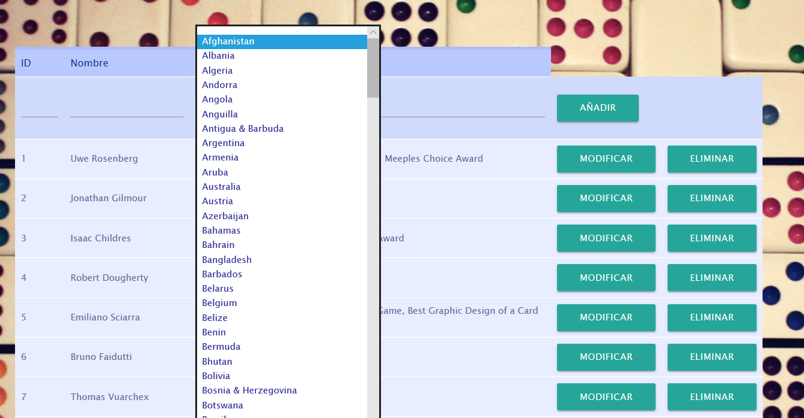

# CRUD Jsp

## Descripción
Repositorio del proyecto Crud en SQL y JSP sobre Gestion de juegos de mesa, el crud constara de un index donde se accedera a las páginas de modificación, creación y borrado de 2 tablas; Juegos y Autores

## Juegos

## Autores

## Implementación de Arraylist en forma de desplegable.

## Implementación de Hashmap en forma de Login
